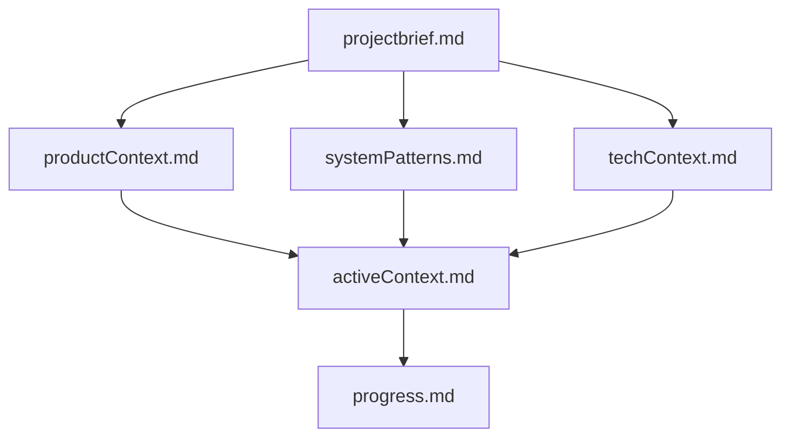

# Memory Bank - Agentic Data Analysis

This memory bank provides comprehensive documentation for the Agentic Data Analysis project, designed to enable seamless project continuity across development sessions.

## Purpose

The memory bank serves as Cline's persistent knowledge base, containing all essential information needed to understand, maintain, and extend the project effectively. Since Cline's memory resets between sessions, this documentation is critical for maintaining project context and development momentum.

## Structure

### Core Files (Required)

1. **[projectbrief.md](./projectbrief.md)**
   - Foundation document defining project scope and purpose
   - Core features and technical foundation
   - Target audience and success metrics
   - Key constraints and project boundaries

2. **[productContext.md](./productContext.md)**
   - User experience goals and target personas
   - Problem definition and solution vision
   - Key user workflows and success metrics
   - Competitive advantages and future roadmap

3. **[systemPatterns.md](./systemPatterns.md)**
   - LangGraph agent architecture and design patterns
   - Component relationships and data flow
   - Technical decisions and scalability patterns
   - Security considerations and performance optimizations

4. **[techContext.md](./techContext.md)**
   - Technology stack and dependencies
   - Development setup and configuration
   - Data models and integration points
   - Deployment considerations and constraints

5. **[activeContext.md](./activeContext.md)**
   - Current work focus and recent discoveries
   - Active decisions and open questions
   - Next steps and development priorities
   - Current system state and configuration

6. **[progress.md](./progress.md)**
   - What's working and fully functional
   - Current status and system health
   - What's left to build and known issues
   - Success metrics and next development cycle

## Usage Guidelines

### For New Sessions
1. **Always read ALL memory bank files** at the start of any task
2. Start with `projectbrief.md` for foundational understanding
3. Review `activeContext.md` for current focus areas
4. Check `progress.md` for system status and priorities

### For Updates
- Update `activeContext.md` when work focus changes
- Update `progress.md` after significant development milestones
- Update technical files when architecture or patterns evolve
- Maintain accuracy and clarity for future sessions

### File Relationships

## Key Insights Captured

### Architecture Highlights
- **LangGraph StateGraph**: Sophisticated agent orchestration with conditional routing
- **Persistent Python Environment**: Variables survive between tool calls for iterative analysis
- **Hybrid Visualization Storage**: JSON-first with pickle fallback for complex objects
- **Multi-tab Streamlit Interface**: Clean separation of data management, chat, and debug views

### Critical Patterns
- **State-driven agent design** with immutable state transitions
- **Sandboxed code execution** with security restrictions
- **Graceful error handling** with partial results
- **Chunked data processing** for scalability

### User Experience Focus
- **Conversational analysis** through natural language queries
- **Iterative exploration** building on previous results
- **Transparent process** with visible AI reasoning
- **Professional visualizations** with Plotly integration

## Development Context

### Current Status
- **Fully Functional**: Core system components operational
- **Production Ready**: Needs security hardening and environment configuration
- **Well Documented**: Comprehensive memory bank and project intelligence
- **Tested**: Validated with financial datasets and fraud detection use cases

### Next Priorities
1. **Security**: Environment variable API key management
2. **User Experience**: Enhanced error handling and progress feedback
3. **Advanced Features**: Multi-dataset relationships and export capabilities
4. **Production**: Deployment guides and monitoring

## Maintenance

This memory bank should be updated when:
- Significant architectural changes are made
- New features or capabilities are added
- User feedback reveals important insights
- Development priorities shift
- System status changes significantly

The documentation is designed to be comprehensive yet concise, providing all necessary context for effective project continuation while remaining maintainable and accurate.
