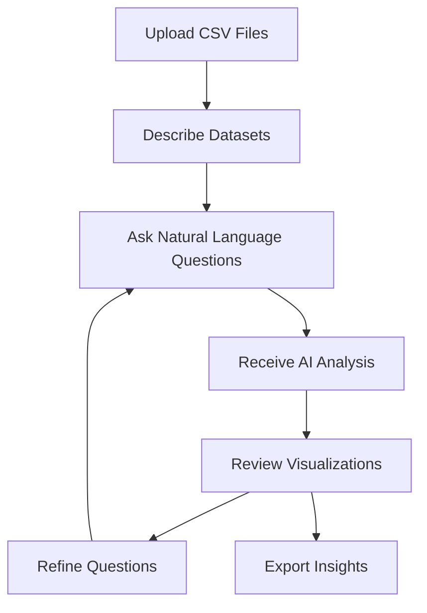

# Product Context - Agentic Data Analysis

## Why This Project Exists

### The Problem
Data analysis is a critical business function, but it's often gatekept by technical complexity:
- **Technical Barrier**: Traditional data analysis requires programming skills (Python, R, SQL)
- **Tool Complexity**: Existing tools like Jupyter notebooks intimidate non-technical users
- **Time Investment**: Learning data science takes months/years
- **Iteration Friction**: Each analysis question requires technical implementation
- **Context Loss**: Insights get lost between analysis sessions

### The Vision
Transform data analysis from a technical skill into a natural conversation. Enable anyone to:
- Ask sophisticated questions about their data in plain English
- Receive professional-grade analysis and visualizations
- Iterate and refine their understanding through dialogue
- Build cumulative insights within analysis sessions

## How It Should Work

### User Journey


### Core User Experience Principles

#### 1. **Conversational Intelligence**
- Users communicate in natural language, not code
- AI translates business questions into technical analysis
- Responses include both insights and reasoning

#### 2. **Transparent Process**
- Users see the AI's thought process
- Code execution is visible but not required knowledge
- Debug view shows intermediate steps

#### 3. **Iterative Refinement**
- Each question builds on previous analysis
- Variables and insights persist within sessions
- Users can drill down or pivot based on findings

#### 4. **Professional Quality**
- Analysis follows data science best practices
- Visualizations are publication-ready
- Insights include statistical context and limitations

## Target User Personas

### Primary: Business Analyst (Sarah)
- **Background**: MBA, works in financial services
- **Pain Point**: Relies on IT team for data analysis, causing delays
- **Goal**: Understand customer transaction patterns for risk assessment
- **Success**: Can independently analyze fraud patterns and present findings

### Secondary: Risk Manager (David)
- **Background**: Finance professional, basic Excel skills
- **Pain Point**: Needs quick insights for decision-making
- **Goal**: Identify anomalies in transaction data
- **Success**: Can spot fraud indicators and quantify risk exposure

### Tertiary: Data-Curious Professional (Maria)
- **Background**: Marketing manager, no technical background
- **Pain Point**: Wants to understand data but intimidated by tools
- **Goal**: Learn from data without learning programming
- **Success**: Gains confidence in data-driven decision making

## User Experience Goals

### Immediate Value (First 5 Minutes)
- Upload data and see meaningful preview
- Ask first question and get useful insight
- Understand the AI's reasoning process

### Short-term Success (First Session)
- Complete a meaningful analysis workflow
- Generate actionable insights
- Create shareable visualizations

### Long-term Adoption (Multiple Sessions)
- Build confidence in data analysis
- Develop intuition for asking better questions
- Reduce dependency on technical teams

## Key User Workflows

### 1. Fraud Detection Analysis
```
User: "Show me patterns in fraudulent transactions"
AI: Analyzes transaction amounts, timing, merchant types
Result: Interactive charts showing fraud indicators
```

### 2. Customer Segmentation
```
User: "How can I group my customers?"
AI: Performs clustering analysis on spending behavior
Result: Customer segments with characteristics
```

### 3. Trend Analysis
```
User: "Are transaction volumes increasing?"
AI: Time series analysis with seasonal decomposition
Result: Trend charts with statistical significance
```

### 4. Risk Assessment
```
User: "Which transactions look suspicious?"
AI: Anomaly detection using multiple algorithms
Result: Risk scores with explanatory factors
```

## Success Metrics

### User Engagement
- **Time to First Insight**: < 2 minutes from upload
- **Questions per Session**: 5+ iterative questions
- **Session Duration**: 15-30 minutes of productive analysis

### Analysis Quality
- **Insight Accuracy**: Statistically sound conclusions
- **Visualization Clarity**: Self-explanatory charts
- **Reasoning Transparency**: Clear explanation of methods

### Business Impact
- **Decision Speed**: Faster insights for business decisions
- **Self-Service Adoption**: Reduced IT analysis requests
- **Confidence Building**: Users feel empowered with data

## Competitive Advantages

### vs. Traditional BI Tools
- **Natural Language**: No query language learning required
- **AI Guidance**: Suggests relevant analysis directions
- **Iterative**: Builds on previous questions naturally

### vs. Code-Based Analysis
- **Accessibility**: No programming knowledge needed
- **Speed**: Immediate results without coding time
- **Reliability**: AI handles technical implementation details

### vs. Static Dashboards
- **Interactive**: Users can ask follow-up questions
- **Exploratory**: Supports open-ended investigation
- **Personalized**: Analysis adapts to user's specific needs

## Future Vision

### Near-term Enhancements
- Multi-dataset joins and relationships
- Advanced statistical tests and modeling
- Export capabilities for presentations

### Long-term Evolution
- Real-time data connections
- Collaborative analysis sessions
- Industry-specific analysis templates
- Automated insight generation and alerts
