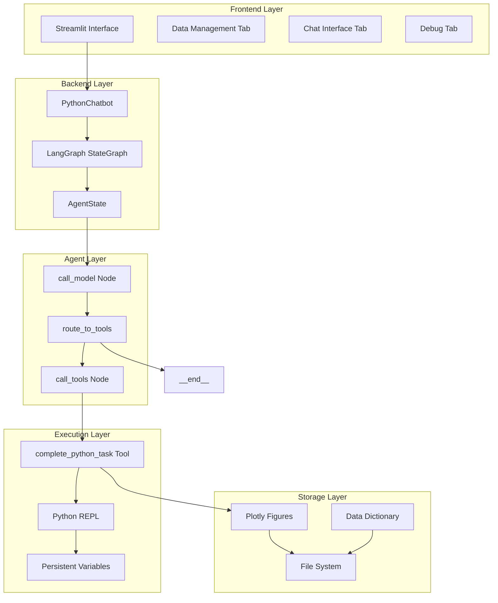

# System Patterns - Agentic Data Analysis

## Architecture Overview

The system implements a sophisticated AI agent architecture using LangGraph for orchestrating conversational data analysis. The design emphasizes modularity, transparency, and iterative refinement.



## Core Design Patterns

### 1. State-Driven Agent Architecture

**Pattern**: LangGraph StateGraph with persistent state management
```python
class AgentState(TypedDict):
    messages: List[BaseMessage]
    input_data: List[InputData]
    output_image_paths: List[str]
    intermediate_outputs: List[dict]
    current_variables: dict
    data_loaded: bool
```

**Key Principles**:
- **Immutable State Transitions**: Each node returns state updates, not mutations
- **Message History**: Complete conversation context maintained
- **Variable Persistence**: Python variables survive between tool calls
- **Output Tracking**: Generated visualizations linked to conversation points

### 2. Conditional Routing Pattern

**Implementation**: `route_to_tools` function determines execution flow
```python
def route_to_tools(state: AgentState) -> Literal["tools", "__end__"]:
    if hasattr(ai_message, "tool_calls") and len(ai_message.tool_calls) > 0:
        return "tools"
    return "__end__"
```

**Design Benefits**:
- **Dynamic Flow**: Agent decides when to execute code vs. respond
- **Natural Termination**: Conversations end organically
- **Tool Validation**: Only valid tool calls trigger execution

### 3. Persistent Execution Environment

**Pattern**: Global variable persistence across tool invocations
```python
persistent_vars = {}  # Global scope
exec_globals.update(persistent_vars)  # Inject into execution
persistent_vars.update({k: v for k, v in exec_globals.items()})  # Extract results
```

**Advantages**:
- **Iterative Analysis**: Build on previous computations
- **Memory Efficiency**: Avoid reloading large datasets
- **Context Continuity**: Variables available across conversation turns

### 4. Hybrid Visualization Storage

**Pattern**: JSON-first with pickle fallback for Plotly figures
```python
try:
    figure_json = pio.to_json(figure)
    with open(json_filename, 'w') as f:
        f.write(figure_json)
except Exception:
    with open(pickle_filename, 'wb') as f:
        pickle.dump(figure, f)
```

**Rationale**:
- **JSON Preferred**: Human-readable, web-compatible
- **Pickle Fallback**: Handles complex objects with periods/custom types
- **UUID Naming**: Prevents filename conflicts

## Component Relationships

### 1. Frontend-Backend Separation

**Streamlit Frontend**:
- **Responsibility**: User interface, file management, display
- **State Management**: Session state for UI components
- **Communication**: Direct method calls to PythonChatbot

**Backend Logic**:
- **Responsibility**: AI orchestration, analysis execution
- **State Management**: LangGraph state for conversation flow
- **Isolation**: No UI dependencies

### 2. Agent-Tool Interaction

**Agent Node (`call_model`)**:
- **Input**: Current state + conversation history
- **Processing**: LLM reasoning with system prompt
- **Output**: Either response message or tool calls

**Tool Node (`call_tools`)**:
- **Input**: Tool calls from agent
- **Processing**: Python code execution in sandboxed environment
- **Output**: Execution results + state updates

### 3. Data Flow Patterns

**Upload → Analysis Flow**:
```
CSV Upload → File Storage → Data Dictionary → Agent Context → Analysis
```

**Question → Answer Flow**:
```
User Query → Agent Reasoning → Tool Selection → Code Execution → Results → Response
```

**Visualization Flow**:
```
Python Code → Plotly Figure → Storage (JSON/Pickle) → UI Display
```

## Key Technical Decisions

### 1. LangGraph Over LangChain

**Rationale**:
- **State Management**: Built-in state persistence
- **Conditional Logic**: Native support for complex routing
- **Debugging**: Better visibility into agent decisions
- **Scalability**: More robust for multi-step workflows

### 2. Streamlit Over Gradio/Flask

**Rationale**:
- **Rapid Development**: Quick UI prototyping
- **Built-in Components**: File upload, tabs, chat interface
- **Python Integration**: Native Python object handling
- **Deployment**: Simple sharing and hosting

### 3. OpenAI GPT-4o Model Selection

**Rationale**:
- **Code Generation**: Strong Python programming capabilities
- **Reasoning**: Good at data science methodology
- **Tool Use**: Reliable function calling
- **Context Window**: Sufficient for conversation history

### 4. Sandboxed Python Execution

**Implementation**:
- **Restricted Imports**: Only pandas, sklearn, plotly allowed
- **Isolated Globals**: Separate execution namespace
- **Output Capture**: Stdout redirection for results
- **Error Handling**: Graceful failure with error messages

## Scalability Patterns

### 1. Chunked Data Processing

**Pattern**: Split large datasets into manageable chunks
```python
chunk_size = min(1000, len(input_state["input_data"]))
data_chunks = [input_state["input_data"][i:i + chunk_size] 
               for i in range(0, len(input_state["input_data"]), chunk_size)]
```

### 2. Recursion Limits and Early Termination

**Configuration**:
```python
{
    "recursion_limit": 15,
    "stop_conditions": {
        "max_messages": 5,
        "min_response_quality": 0.7,
        "early_termination": {"max_quality_plateau": 3}
    }
}
```

### 3. Response Caching

**Implementation**: Cache responses to avoid redundant processing
```python
self.response_cache = set()  # Track processed queries
```

## Error Handling Patterns

### 1. Graceful Degradation

**Strategy**: Return partial results when possible
```python
except Exception as e:
    if "recursion" in str(e).lower():
        return {"partial_result": True, "messages": partial_messages}
```

### 2. Comprehensive Logging

**Implementation**: Structured logging throughout execution pipeline
```python
logger.info(f"Starting processing for user query: {user_query}")
logger.error(f"Graph processing error: {str(e)}")
```

### 3. Validation Gates

**Data Validation**:
- Input data presence checks
- Tool call validation
- State consistency verification

## Security Considerations

### 1. Code Execution Sandboxing

**Restrictions**:
- Limited library imports (pandas, sklearn, plotly only)
- No file system access outside designated directories
- No network operations
- No subprocess execution

### 2. Input Sanitization

**Measures**:
- CSV file type validation
- File size limits (2GB max)
- Path traversal prevention

### 3. API Key Management

**Current**: Hardcoded in source (development only)
**Production**: Environment variable injection required

## Performance Optimizations

### 1. Lazy Loading

**Pattern**: Load datasets only when needed for analysis
```python
df = pd.read_csv(input_dataset.data_path)  # On-demand loading
```

### 2. Message History Truncation

**Implementation**: Keep only recent conversation context
```python
if len(messages) > 10:  # Keep last 10 messages
    messages = messages[:10]
```

### 3. Batch Processing

**Configuration**: Process multiple requests efficiently
```python
compiled_graph.config = {
    "batch_requests": True,
    "max_parallel_requests": 1,
    "request_timeout": 30
}
