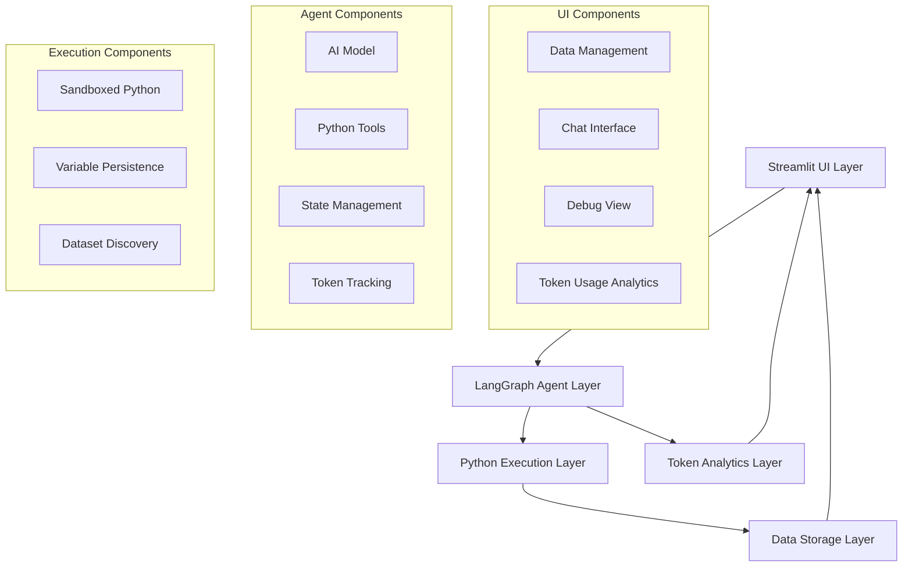
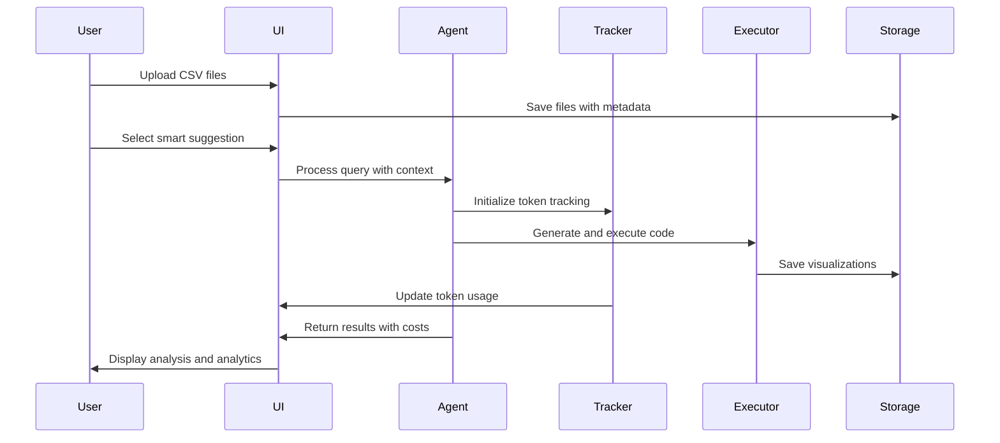
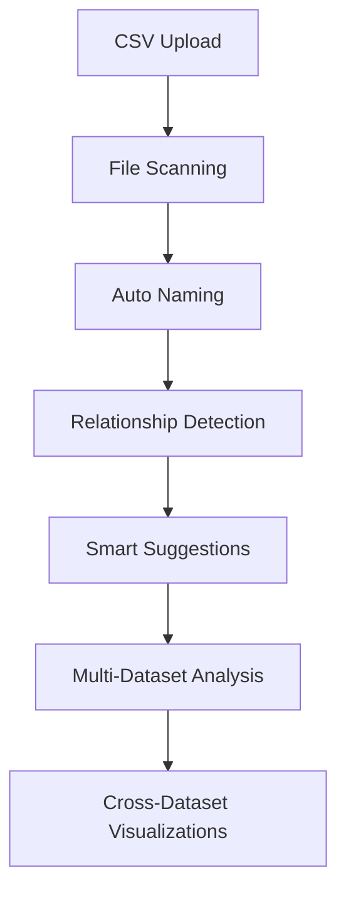
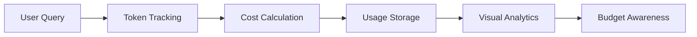

# System Patterns - Agentic Data Analysis

## Architecture Overview

The Agentic Data Analysis system follows a sophisticated multi-layered architecture that combines conversational AI, secure code execution, and intelligent data processing. The system has evolved into a production-ready platform with enterprise-level capabilities.



## Core Design Patterns

### 1. State-Driven Agent Architecture

**Pattern**: Immutable state transitions with comprehensive tracking
**Implementation**: LangGraph StateGraph with conditional routing

```python
# Core pattern for agent nodes
def call_model(state: AgentState):
    # Token tracking integration
    global token_callback
    token_callback = TokenUsageCallback()
    
    # Create data summary with dynamic discovery
    current_data_message = HumanMessage(content=create_data_summary(state))
    messages = [current_data_message] + state["messages"]
    
    # Context limit management
    if len(messages) > 10:
        messages = messages[:10]
    
    # Model invocation with tracking
    llm_outputs = model.invoke(limited_state, config={"callbacks": [token_callback]})
    
    # Token usage integration
    token_info = {
        "total_tokens": token_callback.total_tokens,
        "prompt_tokens": token_callback.prompt_tokens,
        "completion_tokens": token_callback.completion_tokens,
        "estimated_cost": round(token_callback.cost, 6),
        "model": OPENAI_MODEL
    }
    
    return {
        "messages": [llm_outputs],
        "intermediate_outputs": [current_data_message.content],
        "token_usage": token_info
    }
```

**Key Characteristics**:
- Immutable state updates through return values
- Comprehensive token tracking integration
- Context window management
- Error recovery with partial results

### 2. Dynamic Dataset Discovery Pattern

**Pattern**: Automatic detection and relationship analysis for unlimited datasets
**Implementation**: Runtime variable inspection with intelligent naming

```python
# Dynamic dataset discovery pattern
available_datasets = [var for var in locals() if var.startswith('dataset_')]
print(f"Found {{len(available_datasets)}} datasets: {{available_datasets}}")

# Relationship detection
for i, dataset1 in enumerate(available_datasets):
    for dataset2 in available_datasets[i+1:]:
        df1, df2 = locals()[dataset1], locals()[dataset2]
        common_cols = set(df1.columns) & set(df2.columns)
        if common_cols:
            print(f"Common columns between {{dataset1}} and {{dataset2}}: {{common_cols}}")
```

**Key Characteristics**:
- Automatic dataset enumeration (`dataset_0`, `dataset_1`, etc.)
- Cross-dataset relationship detection
- Scalable to unlimited files
- Smart suggestion generation based on data types

### 3. Token Usage Tracking Pattern

**Pattern**: Real-time monitoring with cost calculation and analytics
**Implementation**: LangChain callback system with model-specific pricing

```python
class TokenUsageCallback(BaseCallbackHandler):
    def __init__(self):
        self.total_tokens = 0
        self.prompt_tokens = 0
        self.completion_tokens = 0
        self.cost = 0.0
        
    def on_llm_end(self, response: Any, **kwargs: Any) -> None:
        if hasattr(response, 'llm_output') and response.llm_output:
            token_usage = response.llm_output.get('token_usage', {})
            if token_usage:
                self.total_tokens = token_usage.get('total_tokens', 0)
                self.prompt_tokens = token_usage.get('prompt_tokens', 0)
                self.completion_tokens = token_usage.get('completion_tokens', 0)
                
                # Model-specific cost calculation
                model_name = os.getenv("OPENAI_MODEL", "gpt-4o")
                if "gpt-4o" in model_name:
                    input_cost = (self.prompt_tokens / 1000000) * 5.0
                    output_cost = (self.completion_tokens / 1000000) * 15.0
                    self.cost = input_cost + output_cost
```

**Key Characteristics**:
- Real-time token tracking with callbacks
- Model-specific cost calculation
- Session-based accumulation
- Visual analytics integration

### 4. Enhanced Error Handling Pattern

**Pattern**: Graceful degradation with user-friendly guidance
**Implementation**: Multi-level error recovery with contextual suggestions

```python
def process_user_query(user_query):
    try:
        # Main processing logic
        result = st.session_state.visualisation_chatbot.user_sent_message(user_query, input_data_list)
        
    except Exception as e:
        error_message = str(e)
        if "recursion" in error_message.lower():
            st.error("🔄 The analysis became too complex. Try asking a simpler question or breaking it into smaller parts.")
        elif "openai" in error_message.lower() or "api" in error_message.lower():
            st.error("🔑 There's an issue with the AI service. Please check your API key configuration.")
        elif "memory" in error_message.lower() or "size" in error_message.lower():
            st.error("💾 Your dataset might be too large. Try analyzing a smaller subset of your data.")
        else:
            st.error("❌ Something went wrong with the analysis. Please try rephrasing your question.")
        
        # Technical details for debugging
        with st.expander("🔧 Technical Details (for debugging)"):
            st.code(error_message)
            st.write("**Suggestion:** Try asking a simpler question or check the Debug tab for more information.")
```

**Key Characteristics**:
- User-friendly error messages
- Contextual troubleshooting suggestions
- Technical details available for debugging
- Progressive error recovery

### 5. Smart Suggestion Generation Pattern

**Pattern**: Contextual recommendations based on data characteristics
**Implementation**: File-type analysis with progressive complexity

```python
def generate_smart_suggestions(selected_files):
    suggestions = ["📊 Show me a summary of my data"]
    
    for filename in selected_files:
        file_lower = filename.lower()
        if 'transaction' in file_lower or 'payment' in file_lower:
            suggestions.extend([
                "💳 Analyze transaction patterns and trends",
                "🚨 Detect any fraudulent or unusual transactions",
                "💰 Show spending patterns by category"
            ])
        elif 'customer' in file_lower or 'user' in file_lower:
            suggestions.extend([
                "👥 Segment customers based on behavior",
                "📊 Show customer demographics breakdown",
                "🎯 Identify high-value customers"
            ])
    
    # Remove duplicates while preserving order
    seen = set()
    unique_suggestions = []
    for suggestion in suggestions:
        if suggestion not in seen:
            seen.add(suggestion)
            unique_suggestions.append(suggestion)
    
    return unique_suggestions[:6]
```

**Key Characteristics**:
- File-type aware recommendations
- Progressive complexity suggestions
- Domain-specific query templates
- One-click execution capability

## Component Relationships

### 1. UI Layer Architecture

**Streamlit Multi-Tab Interface**:
- **Data Management**: File upload, preview, metadata editing
- **Chat Interface**: Conversational analysis with smart suggestions
- **Debug**: Transparent AI reasoning and code execution
- **Token Usage**: Real-time analytics and cost tracking

**Key Patterns**:
- Session state management for persistence
- Progress indicators for long operations
- Error recovery with user guidance
- Smart suggestions based on context

### 2. Agent Layer Architecture

**LangGraph StateGraph Components**:
- **Agent Node**: AI reasoning with token tracking
- **Tools Node**: Python code execution
- **Conditional Routing**: Dynamic flow control
- **State Management**: Immutable updates with history

**Key Patterns**:
- Professional AI prompt with domain expertise
- Token usage integration at every step
- Multi-model support via environment variables
- Intelligent recursion limit management

### 3. Execution Layer Architecture

**Sandboxed Python Environment**:
- **Variable Persistence**: Global state between executions
- **Library Restrictions**: Security through limited imports
- **Output Capture**: Structured result collection
- **Error Handling**: Safe execution with recovery

**Key Patterns**:
- Dynamic dataset discovery and naming
- Cross-dataset relationship analysis
- Visualization generation and storage
- Memory management for large datasets

### 4. Storage Layer Architecture

**File System Organization**:
- **Uploads Directory**: User CSV files
- **Images Directory**: Generated visualizations
- **Data Dictionary**: Metadata persistence
- **Token History**: Usage analytics storage

**Key Patterns**:
- JSON-first with pickle fallback for visualizations
- UUID-based naming for conflict prevention
- Metadata enrichment and persistence
- Organized directory structure

## Data Flow Patterns

### 1. Enhanced Analysis Workflow



### 2. Multi-Dataset Discovery Flow



### 3. Token Analytics Flow



## Security Patterns

### 1. Environment Configuration Pattern

**Pattern**: Secure credential and configuration management
**Implementation**: Environment variables with fallback defaults

```python
# Load model configuration from environment variables
OPENAI_MODEL = os.getenv("OPENAI_MODEL", "gpt-4o")
OPENAI_TEMPERATURE = float(os.getenv("OPENAI_TEMPERATURE", "0"))
OPENAI_API_KEY = os.getenv("OPENAI_API_KEY")

llm = ChatOpenAI(
    model=OPENAI_MODEL, 
    temperature=OPENAI_TEMPERATURE,
    api_key=OPENAI_API_KEY,
    callbacks=[token_callback]
)
```

### 2. Sandboxed Execution Pattern

**Pattern**: Secure code execution with limited capabilities
**Implementation**: Restricted imports and controlled environment

```python
# Allowed libraries only
ALLOWED_IMPORTS = ['pandas', 'sklearn', 'plotly', 'numpy']

# Execution with controlled globals
exec_globals = globals().copy()
exec_globals.update(persistent_vars)
exec_globals.update(current_variables)

exec(python_code, exec_globals)
```

### 3. Input Validation Pattern

**Pattern**: Comprehensive validation and sanitization
**Implementation**: Multi-layer validation with error recovery

```python
# CSV validation
def validate_csv_file(file):
    try:
        df = pd.read_csv(file)
        if df.empty:
            raise ValueError("Empty CSV file")
        return True
    except Exception as e:
        return False, str(e)

# Query sanitization
def sanitize_query(query):
    # Remove potentially harmful patterns
    # Validate query structure
    # Return safe query
    pass
```

## Performance Patterns

### 1. Context Window Management

**Pattern**: Intelligent message history truncation
**Implementation**: Sliding window with priority preservation

```python
# Prepare messages ensuring we don't exceed context limits
messages = [current_data_message] + state["messages"]
if len(messages) > 10:  # Keep last 10 messages
    messages = messages[:10]
```

### 2. Visualization Storage Optimization

**Pattern**: Hybrid storage with format optimization
**Implementation**: JSON-first with pickle fallback

```python
# Try JSON first for web compatibility
try:
    figure_json = pio.to_json(figure)
    with open(json_filename, 'w') as f:
        f.write(figure_json)
except Exception:
    # Fallback to pickle for complex objects
    with open(pickle_filename, 'wb') as f:
        pickle.dump(figure, f)
```

### 3. Memory Management Pattern

**Pattern**: Efficient variable persistence with cleanup
**Implementation**: Selective persistence with memory monitoring

```python
# Extract and persist new variables
persistent_vars.update({
    k: v for k, v in exec_globals.items() 
    if k not in globals() and not k.startswith('_')
})

# Cleanup large objects periodically
if len(persistent_vars) > MAX_VARIABLES:
    cleanup_old_variables()
```

## Integration Patterns

### 1. LangChain Integration Pattern

**Pattern**: Advanced callback system for monitoring
**Implementation**: Custom callbacks with state management

```python
class TokenUsageCallback(BaseCallbackHandler):
    def on_llm_start(self, serialized, prompts, **kwargs):
        # Track request start
        pass
        
    def on_llm_end(self, response, **kwargs):
        # Extract and calculate token usage
        # Update cost calculations
        # Store usage metrics
        pass
```

### 2. Streamlit Integration Pattern

**Pattern**: Reactive UI with state management
**Implementation**: Session state with component isolation

```python
# Session state management
if 'visualisation_chatbot' not in st.session_state:
    st.session_state.visualisation_chatbot = PythonChatbot()

# Component isolation
with tab4:  # Token Usage tab
    if 'visualisation_chatbot' in st.session_state:
        total_usage = st.session_state.visualisation_chatbot.get_total_token_usage()
        # Display analytics
```

### 3. Model Configuration Pattern

**Pattern**: Flexible model management with cost optimization
**Implementation**: Environment-based configuration with runtime switching

```python
# Model configuration
SUPPORTED_MODELS = {
    "gpt-4o": {"input_cost": 5.0, "output_cost": 15.0},
    "gpt-4o-mini": {"input_cost": 0.15, "output_cost": 0.60},
    "gpt-4-turbo": {"input_cost": 10.0, "output_cost": 30.0},
    "gpt-3.5-turbo": {"input_cost": 0.50, "output_cost": 1.50}
}

def calculate_cost(model_name, prompt_tokens, completion_tokens):
    if model_name in SUPPORTED_MODELS:
        pricing = SUPPORTED_MODELS[model_name]
        input_cost = (prompt_tokens / 1000000) * pricing["input_cost"]
        output_cost = (completion_tokens / 1000000) * pricing["output_cost"]
        return input_cost + output_cost
    return 0.0
```

These patterns represent the evolved architecture of the Agentic Data Analysis system, incorporating enterprise-level features while maintaining simplicity and usability. The system demonstrates sophisticated software engineering practices while remaining accessible to users of all technical levels.
