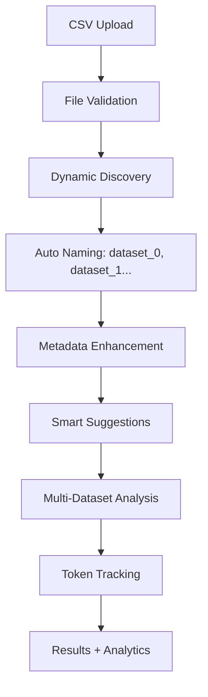
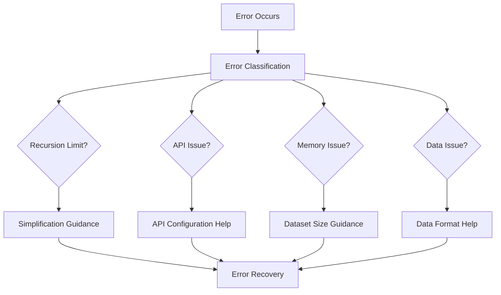

# Technical Context - Agentic Data Analysis

## Technology Stack

### Core Framework Stack
- **Python 3.11+**: Primary development language with modern features
- **Streamlit 1.28.0+**: Web interface framework with enhanced session management
- **LangChain Core 0.1.0+**: AI agent orchestration and tool integration
- **LangGraph**: Advanced state management for conversational AI workflows
- **OpenAI API**: Multi-model support (GPT-4o, GPT-4o-mini, GPT-4-turbo, GPT-3.5-turbo)

### Data Processing Stack
- **Pandas 2.0+**: Advanced data manipulation and analysis
- **NumPy**: Numerical computing foundation
- **Scikit-learn**: Machine learning algorithms and utilities
- **Plotly 5.17.0+**: Interactive visualization with web compatibility

### Enhanced Infrastructure
- **Environment Variables**: Secure configuration management
- **Token Analytics**: Real-time usage monitoring and cost tracking
- **Multi-Model Support**: Flexible AI model configuration
- **Error Recovery**: Comprehensive exception handling and user guidance

## Development Environment

### Enhanced Setup Requirements
```bash
# Core dependencies with version specifications
streamlit>=1.28.0
langchain-core>=0.1.0
langchain-openai>=0.1.0
langgraph>=0.1.0
plotly>=5.17.0
pandas>=2.0.0
scikit-learn>=1.3.0
python-dotenv>=1.0.0

# Development and debugging
logging>=0.4.9.6
typing-extensions>=4.5.0
```

### Environment Configuration
```bash
# Required environment variables
OPENAI_API_KEY=your_openai_api_key_here
OPENAI_MODEL=gpt-4o  # or gpt-4o-mini, gpt-4-turbo, gpt-3.5-turbo
OPENAI_TEMPERATURE=0  # 0-2, controls randomness

# Optional Streamlit configuration
STREAMLIT_SERVER_MAX_UPLOAD_SIZE=2000  # MB
```

### Enhanced Development Workflow
1. **Environment Setup**: `.env` file configuration with model selection
2. **Dependency Management**: `requirements.txt` with version pinning
3. **Token Monitoring**: Real-time cost tracking during development
4. **Error Testing**: Comprehensive error scenario validation
5. **Multi-Model Testing**: Easy switching between AI models for optimization

## Architecture Components

### 1. Enhanced Streamlit Frontend

**Multi-Tab Interface Architecture**:
```python
# 4-tab enhanced interface
tab1, tab2, tab3, tab4 = st.tabs([
    "Data Management", 
    "Chat Interface", 
    "Debug", 
    "Token Usage Analytics"
])

# Smart suggestions integration
def generate_smart_suggestions(selected_files):
    # File-type aware recommendations
    # Progressive complexity guidance
    # Domain-specific templates
    pass

# Enhanced error handling
def process_user_query(user_query):
    # Progress indicators
    # User-friendly error messages
    # Contextual troubleshooting
    pass
```

**Key Features**:
- **Session State Management**: Persistent UI state with error recovery
- **Progress Indicators**: Visual feedback during long operations
- **Smart Suggestions**: Contextual query recommendations
- **Token Analytics**: Real-time usage monitoring and cost visualization
- **Error Recovery**: User-friendly error messages with guidance

### 2. Professional LangGraph Agent System

**Enhanced Agent Architecture**:
```python
# Token tracking integration
class TokenUsageCallback(BaseCallbackHandler):
    def __init__(self):
        self.total_tokens = 0
        self.prompt_tokens = 0
        self.completion_tokens = 0
        self.cost = 0.0
        
    def on_llm_end(self, response, **kwargs):
        # Extract token usage
        # Calculate model-specific costs
        # Update session analytics
        pass

# Multi-model configuration
OPENAI_MODEL = os.getenv("OPENAI_MODEL", "gpt-4o")
OPENAI_TEMPERATURE = float(os.getenv("OPENAI_TEMPERATURE", "0"))

llm = ChatOpenAI(
    model=OPENAI_MODEL, 
    temperature=OPENAI_TEMPERATURE,
    callbacks=[token_callback]
)
```

**Advanced Features**:
- **Professional AI Prompt**: 1,500-word comprehensive methodology
- **Token Usage Tracking**: Real-time monitoring with cost calculation
- **Multi-Model Support**: Environment-based configuration
- **Error Recovery**: Intelligent recursion limit management (25 steps)
- **Domain Expertise**: Specialized knowledge for different data types

### 3. Enhanced Python Execution Environment

**Dynamic Dataset Discovery**:
```python
# Automatic dataset detection
available_datasets = [var for var in locals() if var.startswith('dataset_')]
print(f"Found {len(available_datasets)} datasets: {available_datasets}")

# Cross-dataset relationship analysis
for i, dataset1 in enumerate(available_datasets):
    for dataset2 in available_datasets[i+1:]:
        df1, df2 = locals()[dataset1], locals()[dataset2]
        common_cols = set(df1.columns) & set(df2.columns)
        if common_cols:
            print(f"Common columns between {dataset1} and {dataset2}: {common_cols}")
```

**Security and Performance**:
- **Sandboxed Execution**: Restricted library imports for security
- **Variable Persistence**: Global state management between executions
- **Memory Management**: Efficient handling of large datasets
- **Error Handling**: Safe execution with comprehensive recovery

### 4. Advanced Visualization System

**Enhanced Plotly Integration**:
```python
# Hybrid storage strategy
def save_plotly_figure(figure, filename):
    try:
        # JSON-first for web compatibility
        figure_json = pio.to_json(figure)
        with open(f"{filename}.json", 'w') as f:
            f.write(figure_json)
    except Exception:
        # Pickle fallback for complex objects
        with open(f"{filename}.pkl", 'wb') as f:
            pickle.dump(figure, f)

# Error recovery in visualization display
try:
    if image_path.endswith('.json'):
        fig = pio.from_json(fig_json)
    else:
        fig = pickle.load(f)
    st.plotly_chart(fig, use_container_width=True)
except Exception as e:
    st.error(f"Error displaying chart: {str(e)}")
```

**Key Capabilities**:
- **Interactive Charts**: Full Plotly feature support
- **Error Recovery**: Graceful handling of visualization failures
- **Format Flexibility**: JSON and pickle storage options
- **Web Compatibility**: Optimized for Streamlit display

## Enhanced Data Flow Architecture

### 1. Multi-Dataset Processing Pipeline



### 2. Enhanced Error Handling Flow



### 3. Token Analytics Pipeline


## Security Architecture

### 1. Environment-Based Configuration

**Secure Credential Management**:
```python
# Environment variable loading with validation
import os
from dotenv import load_dotenv

load_dotenv()

# Required configurations
OPENAI_API_KEY = os.getenv("OPENAI_API_KEY")
if not OPENAI_API_KEY:
    raise ValueError("OPENAI_API_KEY environment variable is required")

# Optional configurations with defaults
OPENAI_MODEL = os.getenv("OPENAI_MODEL", "gpt-4o")
OPENAI_TEMPERATURE = float(os.getenv("OPENAI_TEMPERATURE", "0"))
```

### 2. Sandboxed Code Execution

**Security Constraints**:
```python
# Restricted library imports
ALLOWED_LIBRARIES = [
    'pandas', 'numpy', 'sklearn', 'plotly.express', 
    'plotly.graph_objects', 'plotly.io'
]

# Controlled execution environment
def execute_python_code(code, persistent_vars):
    exec_globals = globals().copy()
    exec_globals.update(persistent_vars)
    
    # Remove dangerous functions
    dangerous_functions = ['exec', 'eval', 'open', '__import__']
    for func in dangerous_functions:
        exec_globals.pop(func, None)
    
    exec(code, exec_globals)
    return exec_globals
```

### 3. Input Validation and Sanitization

**Multi-Layer Validation**:
```python
# CSV file validation
def validate_csv_upload(file):
    try:
        df = pd.read_csv(file)
        if df.empty:
            return False, "Empty CSV file"
        if df.shape[0] > 1000000:  # 1M row limit
            return False, "File too large (>1M rows)"
        return True, "Valid CSV file"
    except Exception as e:
        return False, f"Invalid CSV: {str(e)}"

# Query sanitization
def sanitize_user_query(query):
    # Remove potentially harmful patterns
    dangerous_patterns = ['import os', 'exec(', 'eval(', '__import__']
    for pattern in dangerous_patterns:
        if pattern in query.lower():
            return None, f"Query contains restricted pattern: {pattern}"
    return query, "Query is safe"
```

## Performance Optimization

### 1. Memory Management

**Efficient Variable Persistence**:
```python
# Selective variable persistence
def update_persistent_vars(exec_globals, persistent_vars):
    # Only persist DataFrames and analysis results
    for key, value in exec_globals.items():
        if isinstance(value, (pd.DataFrame, dict, list, str, int, float)):
            if not key.startswith('_') and key not in globals():
                persistent_vars[key] = value
    
    # Cleanup old variables if memory usage is high
    if len(persistent_vars) > 100:
        cleanup_old_variables(persistent_vars)
```

### 2. Context Window Management

**Intelligent Message Truncation**:
```python
# Smart message history management
def prepare_messages(state):
    current_data_message = HumanMessage(content=create_data_summary(state))
    messages = [current_data_message] + state["messages"]
    
    # Keep last 10 messages to stay within context limits
    if len(messages) > 10:
        messages = messages[:10]
    
    return messages
```

### 3. Visualization Optimization

**Hybrid Storage Strategy**:
```python
# Optimized figure storage
def store_visualization(figure, base_filename):
    json_path = f"{base_filename}.json"
    pickle_path = f"{base_filename}.pkl"
    
    try:
        # Try JSON first (smaller, web-compatible)
        figure_json = pio.to_json(figure)
        with open(json_path, 'w') as f:
            f.write(figure_json)
        return json_path
    except Exception:
        # Fallback to pickle for complex objects
        with open(pickle_path, 'wb') as f:
            pickle.dump(figure, f)
        return pickle_path
```

## Deployment Architecture

### 1. Local Development Setup

**Development Environment**:
```bash
# Clone repository
git clone <repository-url>
cd AgenticDataAnalysis

# Create virtual environment
python -m venv venv
source venv/bin/activate  # On Windows: venv\Scripts\activate

# Install dependencies
pip install -r requirements.txt

# Configure environment
cp .env.example .env
# Edit .env with your OpenAI API key and model preferences

# Run application
streamlit run data_analysis_streamlit_app.py
```

### 2. Production Considerations

**Scalability Patterns**:
- **Session Isolation**: Each user session is independent
- **Resource Management**: Memory and CPU usage monitoring
- **Error Recovery**: Comprehensive exception handling
- **Cost Control**: Token usage tracking and budget management

**Security Hardening**:
- **Environment Variables**: Secure credential management
- **Input Validation**: Multi-layer sanitization
- **Sandboxed Execution**: Restricted code execution environment
- **Audit Logging**: Comprehensive activity tracking

### 3. Monitoring and Analytics

**Token Usage Monitoring**:
```python
# Real-time usage tracking
class TokenAnalytics:
    def __init__(self):
        self.session_usage = []
        self.total_cost = 0.0
    
    def track_usage(self, tokens, cost, model):
        self.session_usage.append({
            'timestamp': time.time(),
            'tokens': tokens,
            'cost': cost,
            'model': model
        })
        self.total_cost += cost
    
    def get_analytics(self):
        return {
            'total_requests': len(self.session_usage),
            'total_tokens': sum(u['tokens'] for u in self.session_usage),
            'total_cost': self.total_cost,
            'average_tokens': self.total_tokens / len(self.session_usage) if self.session_usage else 0
        }
```

## Integration Points

### 1. LangChain Integration

**Advanced Callback System**:
- **Token Tracking**: Real-time usage monitoring
- **Cost Calculation**: Model-specific pricing
- **Error Handling**: Comprehensive exception management
- **Performance Monitoring**: Request timing and success rates

### 2. Streamlit Integration

**Enhanced UI Components**:
- **Multi-Tab Interface**: Organized feature separation
- **Session State**: Persistent application state
- **Progress Indicators**: User feedback during operations
- **Error Display**: User-friendly error communication

### 3. OpenAI API Integration

**Multi-Model Support**:
- **Model Selection**: Environment-based configuration
- **Cost Optimization**: Real-time cost tracking
- **Error Recovery**: API failure handling
- **Rate Limiting**: Request throttling and retry logic

This technical context represents the evolved architecture of the Agentic Data Analysis system, incorporating enterprise-level features while maintaining development simplicity and user accessibility.
